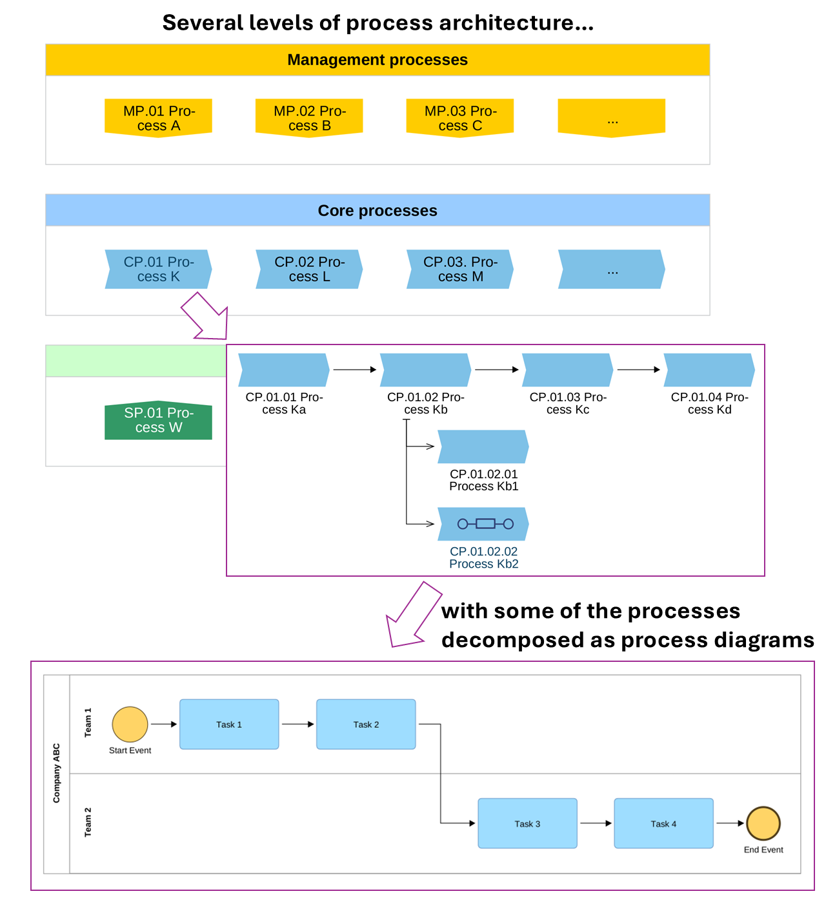
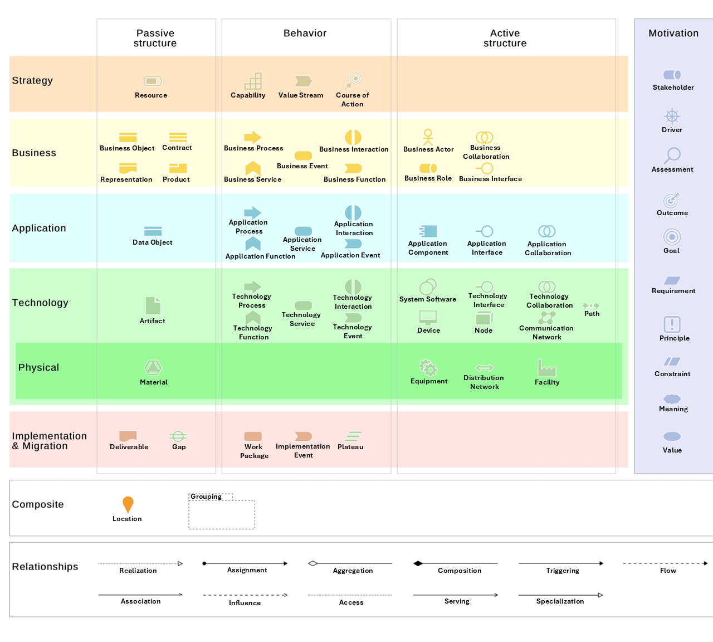

# Additional resources for Chapter 6 (Establishing Process Architecture)

## Further reading

If you want to deepen your knowledge of BPM, the following are suggestions of books and additional resources:

* If you would like to learn more about the naming of processes and the topic of building a business architecture that encompasses process architecture and how it’s related to business capabilities, I strongly recommend the great book **[Business Architecture: Collecting, Connecting, and Correcting the Dots](https://www.amazon.com/Business-Architecture-Collecting-Connecting-Correcting-ebook/dp/B09T7877DV)**, by Roger Burlton. An additional awesome book is **[Reimagining Management: Putting process at the center of business management](https://www.amazon.com/Reimagining-Management-Putting-Process-Business-ebook/dp/B01N2WCPL3)**, by Roger Tregear. Both books are pure gold!
* If you are interested in building an organizational architecture that merges business process management and enterprise architecture management, check out the book **[Successful Architecture Implementation: A practical guide on how to implement your EA/BPM program](https://www.amazon.com/Successful-Architecture-Implementation-practical-implement-ebook/dp/B0DZ76863Q)**, by Roland Woldt.
* If you are interested in real-life cases showing how organizations implement BPM, I do not know a better book than **[Business Process Management Cases Vol. 3: Implementation in Practice](https://www.amazon.com/Business-Process-Management-Cases-Vol-ebook/dp/B0DZ5H5NW3?crid=3FFLECYVQZKH3)**, whose editors are Jan vom Brocke, Jan Mendling, and Michael Rosemann. In particular, I recommend that you read the interesting case about building the process architecture at Poland’s Ministry of Finance to see different approaches to a process architecture.
* You can find additional examples and best practices for creating a process architecture in **[Holistic Business Process Management: Successful with BPMN 2.0 and OCEB 2 Fundamental](https://www.amazon.com/Holistic-Business-Process-Management-Fundamental/dp/B09FCCMDX5)**, by Serge Schiltz. This book is also a great choice if you are interested in gaining a BPM certification.
* I would also like to mention sort of timeless ;) book **[Workflow Modeling: Tools for Process Improvement and Application Development, Second Edition](https://www.amazon.com/Workflow-Modeling-Improvement-Application-Development-ebook/dp/B008O5K65C)**, by Alec Sharp and Patrick McDermott from which the concept of "mushy verb fuzziness" comes from.
* Finally, if you would like to learn more about ArchiMate, I would like to recommend **[Mastering ArchiMate Edition 3.2: A serious introduction to the ArchiMate® enterprise architecture modeling language](https://ea.rna.nl/mastering-archimate-edition-3-2/)**, by Gerben Wierda.

## Images
### Levels of process architecture (Figure 6.3)

### ArchiMate shapes (original version of Figure 6.5)

Original image taken from ADOIT EAM tool. Learn more on: https://docs.boc-group.com/adoit/en/docs/17.4/user_manual/mmconf-000000/#mmconf-210000
