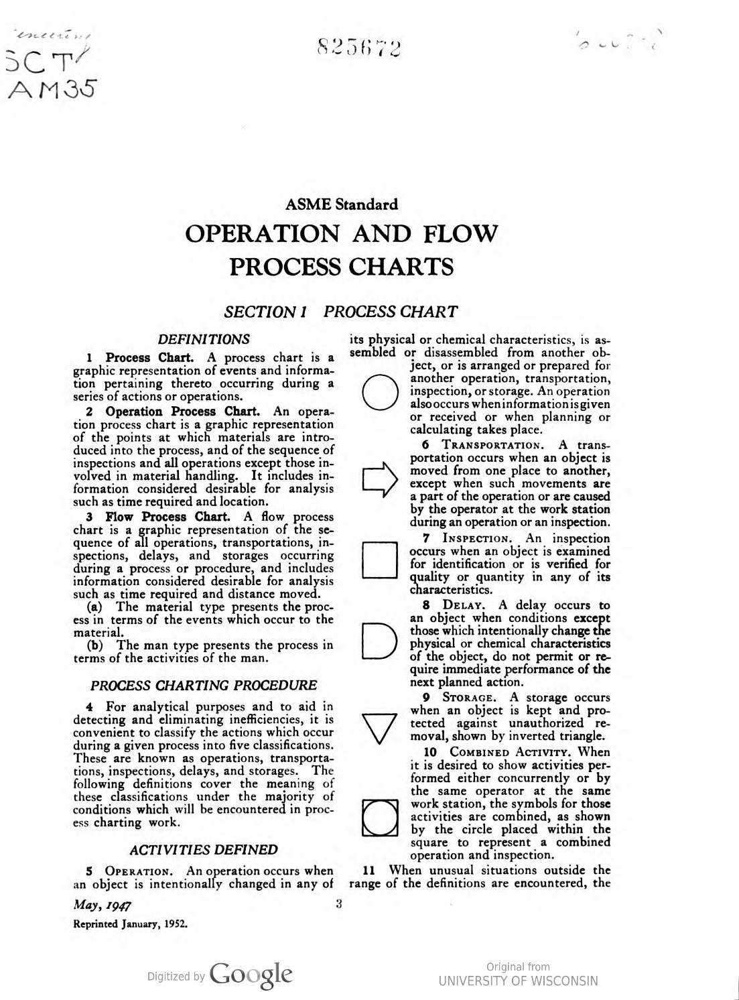
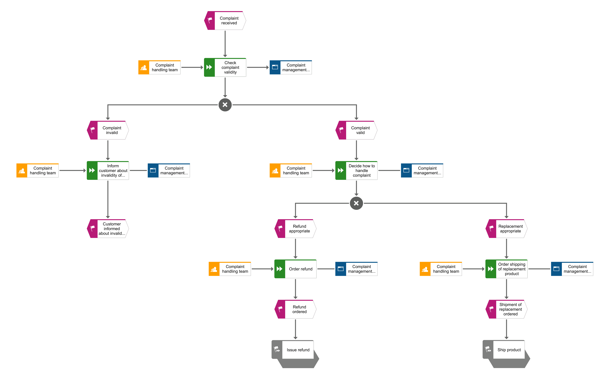

# Additional resources for Chapter 7

## Further reading
If you want to learn more about the modeling notations covered in this chapter (and more), I suggest you check out the following books and resources:
* If you would like to learn more about the history of BPMN and its relationship with other standards, such as XPDL, I would recommend a very interesting free paper, Business Process
Model and Notation—BPMN, by Mark von Rosing, Stephen White, Fred Cummins, and Henk de Man, available at https://www.omg.org/news/whitepapers/Business_Process_Model_and_Notation.pdf. You can also read the full book, **[The Complete Business Process Handbook: Body of Knowledge from Process Modeling to BPM, Volume 1](https://www.amazon.com/Complete-Business-Process-Handbook-Knowledge-ebook/dp/B00R4DX61Q)**, by Mark von Rosing, Henrik von Scheel, and August-Wilhelm Scheer.
* If UML is something you would like to explore further, I would suggest checking out this resource from my go-to expert in UML Filip Stachecki: visit https://www.uml-diagrams.org/
for a great overview of what UML has to offer.
* If you prefer learning from books, on https://modeling-languages.com/list-uml-books/, you will find a list of many great titles. This website offers many useful resources about UML modeling (and more) as well.
* Finally, I would recommend https://agilemodeling.com/ by Scott Ambler.

## Further recommendations
### UPN
If you would like to learn more about the Universal Process Notation, check out page with resources (books, videos and more) prepared by Ian Gotts. You will even find there a video with Ryan Reynolds!!! 
https://elements.cloud/blog/universal-process-notation-upn/

You may also enjoy a book **[Empower Your Workforce: Process Management That Enlightens and Enables](https://www.amazon.com/Empower-Your-Workforce-Management-Enlightens-ebook/dp/B0DCTLC5ZW)**, by Jim Boots. 

Finally, there's a podcast episode on UPN: https://www.whatsyourbaseline.com/2023/04/episode-44-process-notations-and-why-they-are-not-important-walter-bril/ 

### VSM
Value Stream Mapping is a very important Lean tool. One of the most popular books on this topic is **[Learning to See: Value Stream Mapping to Add Value and Eliminate MUDA](https://www.lean.org/store/book/learning-to-see/)**, by Mike Rother and John Shook.

## Images
### Original ASME flowchart shapes

Source: https://babel.hathitrust.org/cgi/pt?id=wu.89083917005&seq=3

### Our example process diagram in EPC notation (kindly provided by Roland Woldt

