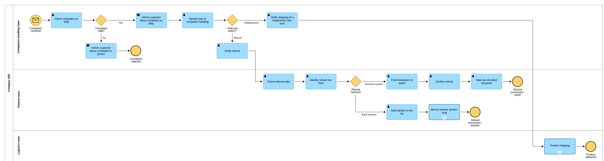
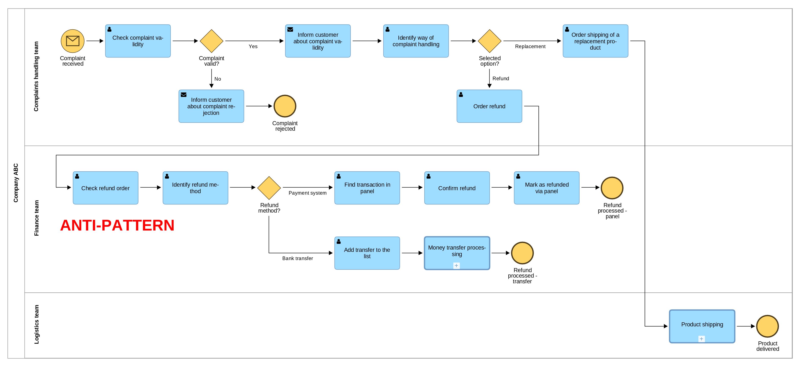

# Additional resources for Chapter 8 (BPMN – What You Need to Know)

## Further reading
If you would like to learn more about the concepts covered in this chapter I would suggest checking **[BPMN Quick and Easy Using Method and Style: Process Mapping Guidelines and Examples Using the Business Process Modeling Standard](https://www.amazon.com/BPMN-Quick-Using-Method-Style-ebook/dp/B0DC4GSL83)** from Bruce Silver – well known BPMN expert.

Additional recommendation is obviously the official webpage of the standard: https://www.bpmn.org/.

## Further recommendations
### Token and gateways in BPMN
Sometimes it is easier to understand some concepts by seeing than by reading. If you would like to see the animations explaining token flow with various gateways you may like the posts on my blog:
1. **[Token in BPMN](https://bpmtips.com/token-in-bpmn/)**
2. **[Exclusive gateways (XOR) and tokens](https://bpmtips.com/exclusive-gateways-xor-and-tokens/)**
3. **[Parallel gateways (AND) and tokens](https://bpmtips.com/parallel-gateways-and-and-tokens/)**
4. **[Inclusive gateways (OR) and tokens](https://bpmtips.com/inclusive-gateways-or-and-tokens/)**

If you are a visual learner I would also suggest my online course: **[BPMN for business analysts](https://www.udemy.com/course/bpmn-for-business-analysts/?referralCode=19755495261FDCA2B4CA)** on Udemy.

## Images
### Improving diagram readability with sub-processes
You could see in Figure 8.44 and Figure 8.46 how hierarchical modeling helps you increase the readability of your diagrams. Now, let's see the alternative - attempt to squeeze everything in one diagram. By the way, it was too hard to read to add in a book ;)

Additionally, you can also compare it with the "snake diagram" (Figure 8.47)

