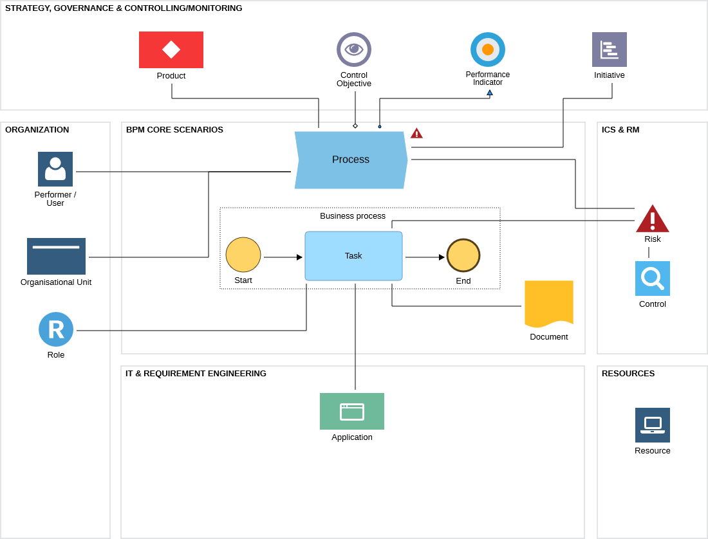

# Additional resources for Chapter 9 (Advanced BPMN)

## Further reading
* If you would like to learn more about DMN, CMMN, and how they work together with BPMN, I suggest looking at a great document, Field Guide to Shareable Clinical Pathways. You can find it via HL7 BPM Community of Practice page: https://www.hl7.org/bpm/index.cfm on https://confluence.hl7.org/spaces/BPM/overview. To make your life easier - here's the direct link as well: https://www.trisotech.com/wp-content/uploads/OMG-Field-Guide-to-sharable-Clinical-Pathways.pdf
* If you would like to learn more about CMMN, there’s a great book, **[CMMN Method and Style: A Practical Guide to Case Management Modeling for Documentation and Execution](https://www.amazon.com/CMMN-Method-Style-Management-Documentation-ebook/dp/B0D7C1GRMR)**, written by Bruce Silver. Bruce also wrote **[DMN Method and Style: 3rd edition, with DMN Cookbook](https://www.amazon.com/DMN-Method-Style-3rd-Cookbook-ebook/dp/B0D9PP9TH9)**. You need to learn about his “Method and Style” approach!
* I also want to recommend **[Real-Life BPMN (5th edition): Includes an introduction to DMN](https://www.amazon.com/Real-Life-BPMN-5th-introduction-DMN-ebook/dp/B0F9YP459S)**, written by Bernd Ruecker and Jakob Freund. My five-star reviews of their books are a good indicator of how much I like what they write.
* Finally, if you want to explore the topic of decision management, the best location I know of is https://dmcommunity.org, run by Jacob Feldman. Apart from DMN-related content, you will find many thought-provoking posts about decision management and AI.

## Further recommendations
### BPMN course
As mentioned on the page with resources for a previous chapter - if you like learning from video courses take a look at my course on Udemy: **[BPMN for business analysts](https://www.udemy.com/course/bpmn-for-business-analysts/?referralCode=19755495261FDCA2B4CA)**.

### BPMN Model Interchange Working Group (MIWG)
If you would like to learn more about BPMN MIWG, see the recordings of the interchange demonstrations, read additional articles, and see the test cases visit https://www.omgwiki.org/bpmn-miwg/doku.php

### BPMN interchange and extensibility
As mentioned in the chapter, BPMN can be extended with more attributes. Those extensions are stored in a special way, but most of them are tool specific and other tools may not show them properly after the interchange. For a bit more technical details see the article **[Making BPMN a True lingua franca](https://bptrends.info/making-bpmn-a-true-lingua-franca/)** on BPTrends.

However, not all the extensions are tool specific. While not universally supported by all the BPMN tools, there are few extensions that are worth mentioning. First one is **[BPMN in color](https://github.com/bpmn-miwg/bpmn-in-color)** developed within the BPMN MIWG. As you may expect it deals with colors for BPMN diagrams. Additional (also developed by BPMN MIWG members) is **[BPMN 2.0 Extension for Internationalization](https://github.com/bpmn-miwg/bpmn-i18n)** also called BPMN i18n. This one deals with storing translations into several language in one diagram.

There's also **[BPSim](https://www.bpsim.org/)** standard for process simulation. Sadly, WfMC (the organization that created this standard) is no longer active, which limits the popularity of BPSim.

### Process simulation
While there's no common standard for simulating BPMN diagrams, several vendors added own extensions to allow it. While tool implementations may differ, you can expect some common elements:
a) At the very least Tasks should have an attribute that allows to specify how long does it take on average to complete it. Of course, there may be more attributes or more options to define the times (e.g., not only execution time, but also waiting time).
b) After the XOR gateways there should be an option to specify probability of the process paths
c) Usually there will be a way to define how often does a process run e.g., per year
d) In addition, you will often see information related to resources and roles involved in executing those tasks such as their availability and cost.

On a basis of such information you can run the simulation that calculates the parameters of the process and allows you to compare different variants to pick the most promising one for implementation. As an example I am sharing documentation for ADONIS with a video showing the process simulation: https://docs.boc-group.com/adonis/en/docs/17.0/user_manual/sim-000000/

### Risk management
Additional aspect that can be added to the process repository is risk management. This is a broad discipline with a long history, so I will provide here only a very brief information.

Both for a Process (from a Process architecture) or a given process step such as Task you can identify risks that can have a negative impact on the results of the process. In our example process an obvious risk would be a fraud. Addtional risk that we could identify could be an employee error. Each risk can also have more attributes. In the super simple form you can expect that risk will have not only a name, but also a description, a person responsible for it and elements of the risk assessment: probability and impact. Obviously frequent (probable) risks with big impact are something we should do something about. That's where control mechanisms come handy. Example control mechanism could be e.g., four eye principle where important decisions need to be reviewed by two people. Other example would be adding some mechanisms for fraud identification. Such information could be shown as FMEA for risks (ADONIS example: https://docs.boc-group.com/adonis/en/docs/17.0/user_manual/modwv-00000/#modwv-01200) or a process-risk-control matrix.

### RACI
As mentioned in this chapter, BPMN does not give us nice connection with information about the organizational structure and responsibilities. Using lanes is OK, but sometimes you need more. Many tools allow you to define the roles (linked with organizational units) and connect them to the Tasks as Responsible, Accountable, Consulted, and Informed. As you may expect this is not useful for documentation purposes, but also can be used in simulation or for showing who does what. 

As an example I am sharing link to page showing RACI analysis in ADONIS: https://docs.boc-group.com/adonis/en/docs/17.0/user_manual/modwv-00000/#modwv-01100

### Metamodeling and conceptual modeling
If the idea of covering not only processes, but also other aspects sounds interesting you may want to learn more about the concept of metamodeling.
Image below (taken from https://docs.boc-group.com/adonis/en/docs/17.1/user_manual/amm-000000/#bpmn-fit-for-business) shows an example simple metamodel i.e., various object types connected with relations.

You can also learn more about the conceptual modeling and metamodeling from the following books:

Book series "Domain-Specific Conceptual Modeling"

**[Domain-Specific Conceptual Modeling: Concepts, Methods and Tools](https://www.amazon.com/Domain-Specific-Conceptual-Modeling-Concepts-Methods-ebook/dp/B01JAIVWU4)** whose editors are Dimitris Karagiannis, Heinrich C. Mayr, and John Mylopoulos.

**[Domain-Specific Conceptual Modeling: Concepts, Methods and ADOxx Tools](https://www.amazon.com/Domain-Specific-Conceptual-Modeling-Concepts-Methods-ebook/dp/B09VD7FVMY)** whose editors are Dimitris Karagiannis, Moonkun Lee, Knut Hinkelmann, and Wilfrid Utz.

And upcoming **[Domain-Specific Conceptual Modeling: The OMiLAB Community of Practice](https://www.amazon.com/Domain-Specific-Conceptual-Modeling-Community-Practice/dp/3031986598)** whose editors are Xavier Boucher, Robert Andrei Buchmann, Hans-Georg Fill, Dimitris Kyritsis, and Wilfrid Utz.

Finally, there's also a very special book **[Metamodeling: Applications and Trajectories to the Future: Essays in Honor of Dimitris Karagiannis](https://www.amazon.com/Metamodeling-Applications-Trajectories-Dimitris-Karagiannis-ebook/dp/B0D9V789TS)** whose editors are Hans-Georg Fill and Harald Kühn.

